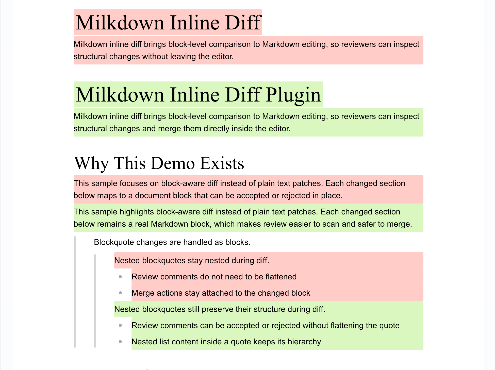

# @milkdown/plugin-inline-diff

Block-level Markdown diff and merge controls for Milkdown editors.



## Overview

`@milkdown/plugin-inline-diff` compares Markdown documents as block structures instead of raw text lines. It is designed for in-editor review flows where users need to inspect and merge changes without leaving the editor.

It works well for:

- `heading`
- `paragraph`
- `blockquote`
- nested `blockquote`
- `list`
- nested `list`
- `table`
- `code block`

## Installation

```bash
pnpm add @milkdown/plugin-inline-diff
```

You also need the normal Milkdown editor dependencies used by your app.

## Quick Start

```ts
import { Editor } from "@milkdown/core";
import { commonmark } from "@milkdown/preset-commonmark";
import {
  diffConfig,
  diffPlugins,
} from "@milkdown/plugin-inline-diff";
import "@milkdown/plugin-inline-diff/style.css";

const editor = Editor.make()
  .use(commonmark)
  .use(diffPlugins)
  .config(
    diffConfig({
      acceptButtonTitle: "Accept Change",
      rejectButtonTitle: "Keep Original",
      originContent: "# Original",
      modifiedContent: "# Modified",
    }),
  );

await editor.create();
```

If both `originContent` and `modifiedContent` are provided, the plugin will automatically enter diff mode after the editor view is ready.

## Public API

### `diffPlugins`

Milkdown plugin array used with:

```ts
editor.use(diffPlugins);
```

### `diffConfig(options)`

Configuration helper used with:

```ts
editor.config(diffConfig({ ... }));
```

```ts
interface DiffConfig {
  acceptButtonTitle?: string;
  rejectButtonTitle?: string;
  originContent?: string;
  modifiedContent?: string;
}
```

### `diff(ctx, modifiedContent, originContent?)`

Enters diff mode on demand.

```ts
editor.action((ctx) => {
  diff(ctx, modifiedContent, originContent);
});
```

Use this when you want to trigger comparison after editor creation, after loading remote content, or after switching between document versions.

### `jumpTo(ctx, index)`

Moves focus to a specific diff group.

```ts
editor.action((ctx) => {
  jumpTo(ctx, 0);
});
```

This is useful for custom navigation bars, side panels, or review workflows.

### `merge(ctx, action, index, all?)`

Accepts or rejects a diff group, or resolves all groups at once.

```ts
editor.action((ctx) => {
  merge(ctx, "accept", 0);
});

editor.action((ctx) => {
  merge(ctx, "reject", 0, true);
});
```

### `getDiffState(ctx)`

Returns the current diff state for external UI.

```ts
const state = editor.action((ctx) => getDiffState(ctx));
```

The returned state includes:

- `count`: total number of diff groups
- `currentIndex`: current focused diff group index, or `-1` before the first group

This is the function to use when building your own merge bar, status panel, or conflict navigator.

## Typical Review Flow

```ts
editor.use(diffPlugins).config(
  diffConfig({
    acceptButtonTitle: "Accept Change",
    rejectButtonTitle: "Keep Original",
  }),
);

editor.action((ctx) => {
  diff(ctx, modifiedMarkdown, originMarkdown);
});

const state = editor.action((ctx) => getDiffState(ctx));

editor.action((ctx) => {
  jumpTo(ctx, state.currentIndex + 1);
});

editor.action((ctx) => {
  merge(ctx, "accept", state.currentIndex);
});
```

## Listening For Changes

If you want to keep external UI in sync with the editor, listen to Milkdown or Crepe update events and read diff state inside the callback.

```ts
const syncDiffState = () => {
  const state = editor.action((ctx) => getDiffState(ctx));
  setDiffState(state);
};

crepe.on((listener) => {
  listener.mounted(syncDiffState);
  listener.updated(syncDiffState);
  listener.selectionUpdated(syncDiffState);
});
```

This pattern is used in the React demo to drive the custom merge bar.

## Demo

The repository includes a runnable React demo in [examples/react](/Users/binzhang/Documents/falcon/milkdown-inline-diff/examples/react).

It demonstrates:

- `editor.use(diffPlugins).config(diffConfig(...))`
- automatic diff on initial content
- custom tooltip button titles
- custom merge bar UI driven by `getDiffState(ctx)`
- `jumpTo` navigation
- `merge(..., all)` bulk actions

## Styling

Import the plugin stylesheet once:

```ts
import "@milkdown/plugin-inline-diff/style.css";
```

You can then override the tooltip and review UI styles in your app theme if needed.

## License

MIT
